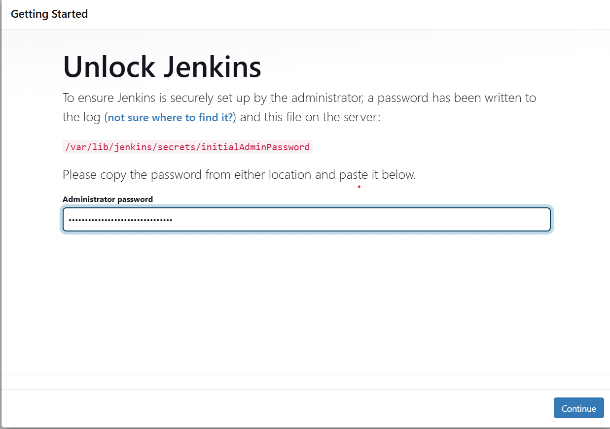
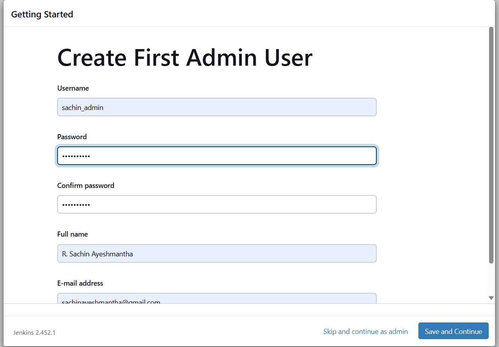

# Jenkins_Project_with_Docker-Agent


### Set up an AWS EC2 instance

 Create an IAM user & login to your AWS Console
    - Access Type - Password
    - Permissions - Admin
2. Create an EC2 instance
    - Select an OS image - Ubuntu
    - Create a new key pair & download `.pem` file
    - Instance type - t2.micro
3. Connecting to the instance using ssh
```
ssh -i instance.pem ubunutu@<IP_ADDRESS>
```

### Installing Java

Pre-Requisites: Java (JDK)


1. Updating the outdated packages and dependencies
```
sudo apt update
```
2. Install java
```
sudo apt install openjdk-11-jre
```
3. Verify Java is Installed
```
java -version
```

### Install Jenkins

Now, you can proceed with installing Jenkins
Resources : jenkins.io (https://www.jenkins.io/doc/book/installing/linux/)
```
curl -fsSL https://pkg.jenkins.io/debian/jenkins.io-2023.key | sudo tee \
  /usr/share/keyrings/jenkins-keyring.asc > /dev/null
echo deb [signed-by=/usr/share/keyrings/jenkins-keyring.asc] \
  https://pkg.jenkins.io/debian binary/ | sudo tee \
  /etc/apt/sources.list.d/jenkins.list > /dev/null
sudo apt-get update
sudo apt-get install jenkins

```
**Note: ** By default, Jenkins will not be accessible to the external world due to the inbound traffic restriction by AWS. Open port 8080 in the inbound traffic rules as show below.

- EC2 > Instances > Click on <Instance-ID>
- In the bottom tabs -> Click on Security
- Security groups
- Add inbound traffic rules as shown in the image (you can just allow TCP 8080 as well, in my case, I allowed `All traffic`).

### Login to Jenkins using the below URL:
```
http://<ec2-instance-public-ip-address>:8080 
```
After you login to Jenkins,run this command to copy the Jenkins Admin Password 
```
sudo cat /var/lib/jenkins/secrets/initialAdminPassword
```


### Click on Install suggested plugins

### Creating First Admin User


Create First Admin User or Skip the step [If you want to use this Jenkins instance for future use-cases as well, better to create admin user]


### Grant Jenkins user and Ubuntu user permission to docker deamon.

```
sudo su - 
usermod -aG docker jenkins
usermod -aG docker ubuntu
systemctl restart docker
```
To check whether jenkins user has access to docker:
```
su - jenkins
docker run hello-world
```

Once you are done with the above steps, it is better to restart Jenkins.

```
http://<ec2-instance-public-ip>:8080/restart
```

The docker agent configuration is now successful.


